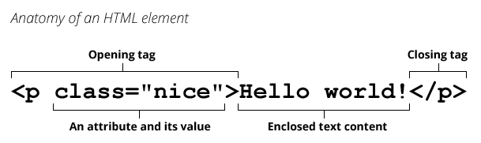
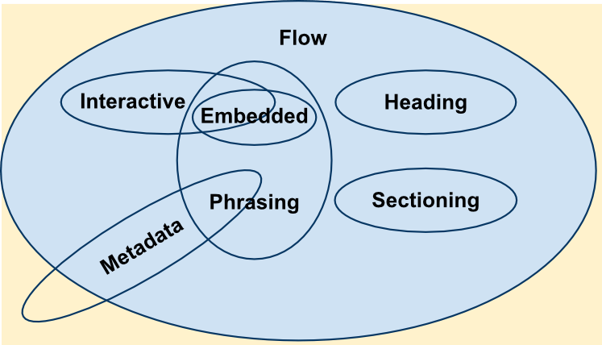

# HTML – Semantisk struktur og skjemaer

HTML kan bety flere forskjellige ting avhengig av hvem du spør, det vi skal lære om i dag er formaterings språket HTML. Vi kommer til å se på hvordan det fungerer, hva det består av og beste måter å løse problemer på.

## Emner

> [!TIP]  
> Klikk på en link for å hoppe rett til emnet

- [Hva er HTML](#hva-er-html)
  - [Domain object model (DOM)](#domain-object-model-dom)
  - [HTML elementer](#html-elementer)
  - [Semantisk HTML](#semantisk-html)
  - [Kategorier](#kategorier)
  - [Nesting](#nesting)
  - [Attributter](#attributter)
- [Linking](#linking)
- [Tabeller](#tabeller)
- [Skjemaer](#skjemaer-forms)
- [Events](#events)
- [Tilgjengelighet](#tilgjengelighet-accessibility)
- [Feilsøking](#feilsøking)

## Mål

- **Domain object model:** Forstå hvordan datamaskinen/nettleresen tolker og behandler HTML koden.
- **Semantisk HTML:** Forstå hva som menes med "semantisk" HTML og hvorfor det er viktig.
- **HTML attributter:** Forstå hvorfor og hvordan vi bruker attributter.
- **Tilgjengelighet:** Lære grunnleggende prinsipper for tilgjengelighet på web (f.eks. alt-tekst på bilder, bruk av labels for skjemaelementer).
- **Skjemaer:** Kunne bygge en enkel HTML-skjema (form) med de vanligste feltene på riktig måte.

## Hva er HTML?

> [!NOTE]  
> Les mer utfyllende forklaring på [mdn](https://developer.mozilla.org/en-US/docs/Learn_web_development/Core/Structuring_content/Basic_HTML_syntax#what_is_html)

HTML (HyperText Markup Language) er et markeringsspråk som forteller nettlesere hvordan de skal strukturere nettsidene du besøker, og består av en serie elementer som du bruker til å omslutte, pakke inn eller markere ulike deler av innholdet, slik at det vises eller oppfører seg på en bestemt måte. Et HTML dokument (f.eks `index.html`) består av flere [elementer](https://developer.mozilla.org/en-US/docs/Web/HTML/Reference/Elements), blant disse er flere av dem nødvendig for å kunne skikkelig vise innholdet. Under kan du se et minimalistisk eksempel på HTML

```html
<!DOCTYPE html>
<html>
  <head>
    <title>Mitt eksempel</title>
  </head>
  <body></body>
</html>
```

### Domain object model (DOM)

> [!NOTE]
> Du kan lese mer om DOM her ([mdn](https://developer.mozilla.org/en-US/docs/Glossary/DOM))

Nettleseren eller serveren som leser HTML koden vi har skrevet tolker så alle elementene i koden, og lager et [DOM-tree](https://developer.mozilla.org/en-US/docs/Glossary/DOM) av innholdet, vi kan da programatisk manipulere innholdet på siden med Javascript.
Du kan se på det som at DOM er bare HTML konvertert til et format som nettleseren kan forstå og jobbe med.

For nå er det godt nok at dere vet om DOM og at det er måten nettleseren behandler HTML, vi kommer til lære mer utdypende om dette i Javascript emnet senere.

### HTML elementer

> [!NOTE]  
> Liste over alle HTML elementer er tilgjengelig på [mdn](https://developer.mozilla.org/en-US/docs/Web/HTML/Reference/Elements)

[Elementer](https://developer.mozilla.org/en-US/docs/Glossary/Element) er en av byggeklossene vi bruker for å sitte sammen en HTML fil/dokument, og består som regel av flere deler. I bildet under kan vi se et eksempel på hvordan et paragraf element er satt sammen.



Ofte blir elementer og [tagger](https://developer.mozilla.org/en-US/docs/Glossary/Tag) brukt om hverandre, men her er det viktig å være konsekvent på ordbruken. [Tagger](https://html.spec.whatwg.org/multipage/syntax.html#elements-2) starter eller avslutter et element i kildekoden, mens elementer er en del av dokumentmodellen (DOM) som brukes for å vise siden i nettleseren.

### Semantisk HTML

[Semantisk HTML](https://developer.mozilla.org/en-US/docs/Glossary/Semantics#semantics_in_html) betyr å bruke elementer som har riktig _betydning_ for innholdet du skriver. Det gjør sidene dine lettere å forstå for både nettlesere, søkemotorer og hjelpemidler som skjermlesere.

Vanlige semantiske elementer inkluderer for eksempel:

- **`<header>`**, **`<nav>`**, **`<main>`**, **`<section>`**, **`<article>`**, **`<aside>`**, **`<footer>`** – disse beskriver struktur og ulike områder på siden.
- Tekstinnhold: **`<h1>`–`<h6>`** for overskrifter (bruk riktig nivå for å reflektere innholdets hierarki og seo), **`<p>`** for avsnitt, **`<ul>`/`<ol>`** for lister, **`<li>`** for listepunkter, **`<strong>`** for viktige ord, **`<em>`** for utheving osv.

Semantiske tagger gir dokumentet mening. Unngå å bruke generiske containere som `<div>` eller `<span>` _istedenfor_ semantiske tagger når det finnes en passende tagg. For eksempel, bruk `<nav>` for navigasjonsmenyer i stedet for `<div id="menu">`, og bruk `<article>` eller `<section>` for innholdsdeler i stedet for mange unødvendige `<div>`.

Et eksempel på å forbedre semantikken:

```html
<!-- Mindre semantisk: bruker generiske <div> -->
<div class="header">
  <div class="nav">...lenker...</div>
</div>
<div class="main">
  <h1>Min Blogg</h1>
  <div class="section">
    <h2>Innlegg</h2>
    <p>Velkommen!</p>
  </div>
</div>

<!-- Mer semantisk: bruker HTML5 elementer -->
<header>
  <nav>...lenker...</nav>
</header>
<main>
  <h1>Min Blogg</h1>
  <section>
    <h2>Innlegg</h2>
    <p>Velkommen!</p>
  </section>
</main>
```

Som du ser, formidler den semantiske versjonen bedre _hva_ de forskjellige delene av siden er. Dette hjelper blant annet brukere med skjermleser, som da kan navigere fra overskrift til overskrift, hoppe rett til hovedinnholdet med `<main>`, etc., uten å bli forvirret av en "div-suppe". Det hjelper også søkemotorer å indeksere siden mer presist.

### Kategorier

De fleste HTML-elementer tilhører en eller flere [kategorier](https://developer.mozilla.org/en-US/docs/Web/HTML/Guides/Content_categories), avhengig av felles egenskaper. Dette er en løs inndeling som hjelper med å definere og beskrive kategorienes felles oppførsel og tilhørende regler er. Innholdskategoriene brukes til å definere innholdsmodellen til elementer — med andre ord hva hvert element kan ha som etterkommere (barn/underliggende elementer). For eksempel kan et `<p>`-element bare inneholde 'frase' innhold (phrasing content), mens et `<div>`-element kan inneholde flytinnhold (flow content).

Det finnes sju hovedkategorier for innhold, som kan oppsummeres med Venn-diagrammet nedenfor



Du kan lese mer om hver kategori, og alle HTML elementer som tilhører den, ved å klikke en link under.

- [Metadata content](https://developer.mozilla.org/en-US/docs/Web/HTML/Guides/Content_categories#metadata_content) - Definerer eller endrer funksjonalitet
- [Flow content](https://developer.mozilla.org/en-US/docs/Web/HTML/Guides/Content_categories#flow_content) - De aller fleste elementer faller i denne kategorien
- [Sectioning content](https://developer.mozilla.org/en-US/docs/Web/HTML/Guides/Content_categories#metadata_content) - For å dele en flow i seksjoner
- [Heading content](https://developer.mozilla.org/en-US/docs/Web/HTML/Guides/Content_categories#heading_content) - For å gi en "section content" en tittel
- [Phrasing content](https://developer.mozilla.org/en-US/docs/Web/HTML/Guides/Content_categories#phrasing_content) - Refererer til tekst og markup i et dokument
- [Embedded content](https://developer.mozilla.org/en-US/docs/Web/HTML/Guides/Content_categories#embedded_content) - Elementer som importerer eller henter inn innhold

### Nesting

Elementer som tilhører flow,

### Attributter

## Linking

## Tabeller

## Skjemaer (forms)

Skjemaer lar brukere taste inn data (som tekst i et kontaktskjema, valg i en quiz, osv.) og sende det inn. I React kommer håndtering av skjemaer til å være en viktig del, så vi må kunne grunnprinsippene i ren HTML først.

**Typiske skjemaelementer:**

- `<form>`: Beholderen for hele skjemaet. Den kan ha attributter som `action` (URL hvor data sendes) og `method` (HTTP-metode, typisk "GET" eller "POST"), men for nå holder vi fokus på strukturen og lar JavaScript håndtere innsending.
- `<input>`: Felt for brukerinput. Viktige typer inkluderer `type="text"` (en-linje tekstfelt), `email`, `password`, `number`, `checkbox` (avkrysningsboks), `radio` (radioknapp for valg), `file` (opplasting). `<input>` er _self-closing_ (trenger ikke egen slutt-tagg).
- `<label>`: Som nevnt, kobler tekst til et spesifikt input-felt via `for`-attributtet.
- `<button type="submit">`: Knapp for å sende inn skjemaet. Når denne klikkes, vil nettleseren som standard forsøke å sende skjemadata og laste en ny side (med mindre vi avbryter med JavaScript).

En enkel struktur for et skjema:

```html
<form>
  <label for="navn">Navn:</label>
  <input type="text" id="navn" name="navn" required />

  <label for="melding">Melding:</label>
  <textarea id="melding" name="melding"></textarea>

  <button type="submit">Send inn</button>
</form>
```

Her har vi et tekstfelt, et tekstområde (flere linjer) og en send-knapp. Attributtet `name` på inputs er det som blir nøkkelen for verdien når data sendes inn (f.eks. navn=Ola). Vi har også satt `required` på navn, som forteller nettleseren at feltet ikke kan være tomt.

**Skjema og semantikk:** Pakk relaterte felt i en `<fieldset>` med en `<legend>` hvis det gir mening (for eksempel en gruppe radioknapper som hører sammen). Dette gir struktur og kontekst.

Som webutvikler vil du ofte bruke JavaScript for å kontrollere skjema-oppførsel (validere input, sende data via API, osv.). Men det er lurt å definere skjemaet korrekt i HTML først, slik at du får gratis funksjonalitet (f.eks. innebygd e-postvalidering med `type="email"` og `required`).

## Events

https://developer.mozilla.org/en-US/docs/Web/API/Document_Object_Model/Events

## Tilgjengelighet (Accessibility)

"Tilgjengelighet" handler om å gjøre nettsider brukbare for alle mennesker, inkludert de med nedsatt syn, hørsel eller motorikk. Mange tiltak for tilgjengelighet er en del av god HTML-skikk, for eksempel:

- **Bilder med alt-tekst:** Hver gang du bruker `` **må** du inkludere en `alt`-attributt som beskriver bildet. Dette gjør at de som ikke ser bildet (f.eks. bruker skjermleser eller hvis bildet ikke laster) får en tekstbeskrivelse. Eksempel:

  ```html
  
  ```

- **Skjema-labels:** Bruk `<label>`-elementet for å knytte tekstbeskrivelser til skjemakontroller (input-felter). En `<label>` med `for`-attributt koblet til riktig `id` på `<input>` gjør at brukeren kan klikke på label-teksten for å fokusere feltet, og skjermlesere leser opp label sammen med feltet. Eksempel:

  ```html
  <label for="email">E-post:</label>
  <input type="email" id="email" name="email" required />
  ```

  I eksempelet over vil skjermleseren si noe à la "E-post: redigerbart tekstfelt" og indikere at feltet er obligatorisk (fordi vi brukte `required`).

- **Knapp vs lenke:** Bruk `<button>` for klikkbare knapper som utfører en handling (spesielt i skjemaer), og `<a>` (anker) for navigasjonslenker som tar deg til en annen side. Dette hjelper brukeragenten å forstå intensjonen – f.eks. en `<button>` i et skjema trigges når man trykker Enter, mens lenker ikke gjør det.

- **Generelt:** Følg standard HTML-praksis: bruk riktige elementer til riktig innhold. Det som er semantisk riktig, er som oftest også mer tilgjengelig. Unngå ting som blinkende innhold, og sørg for god fargekontrast og lesbar tekst (CSS-relatert, men verdt å nevne).

Tilgjengelighetsfeltet er stort, men du trenger ikke kunne alt nå. Tenk bare over at koden din skal kunne leses av noen som ikke ser designet. En fin test er "egenlesing": les HTML-koden din høyt og se om strukturen og innholdet gir mening.

## Feilsøking

**Tips:** Sørg alltid for at HTML-strukturen din er korrekt nestet og følger en logisk struktur. Start HTML-filen med `<!DOCTYPE html>` og `<html lang="no">` for å definere dokumentspråk. I `<head>`-delen angir du metadata og `<title>`. I `<body>` plasserer du det synlige innholdet med semantiske elementer.

## Hva skal jeg gjøre nå?

Nå som du har en grunnleggende forståelse av HTML, er det på tide å omsette dette i praksis. Gå videre til oppgavebeskrivelsen i [ASSIGNMENT.md](./ASSIGNMENT.md) for HTML-modulen og prøv deg frem!

Hvis du ønsker å lese mer om HTML så kan du sjekke ut de følgende ressursene

- MDN guides ([mdn](https://developer.mozilla.org/en-US/docs/Web/HTML/Guides))
- HTML cheatsheet ([mdn](https://developer.mozilla.org/en-US/docs/Web/HTML/Guides/Cheatsheet))
